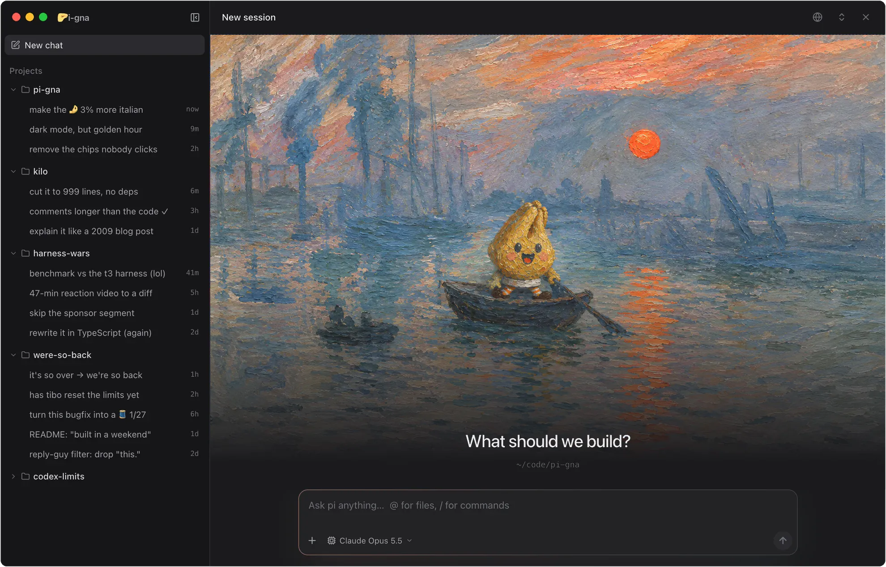

<p align="center"></p>

<h1 align="center">🤌i-gna</h1>

<p align="center">A desktop app for the <a href="https://pi.dev">pi coding agent</a>. Your pi, with a window.</p>



**pi-gna** (Italian *pigna*, as in the 🤌 "mano a pigna" gesture) is a frontend, not a fork. Every chat is a
`pi --mode rpc` process running the pi you already have: your models and logins, settings, extensions, skills,
prompt templates and MCP servers, and your sessions are pi's own session files. Start a chat in the terminal,
continue it in pi-gna, and go back. Nothing to migrate, nothing to configure twice.

macOS only for now (Apple silicon and Intel).

## Install

**Let pi do it.** Paste this into pi (or any coding agent):

```text
Install pi-gna for me by following the "For agents" steps in https://github.com/manuelcecchetto/pi-gna
```

**Or by hand:** download `pi-gna-arm64.dmg` (Apple silicon) or `pi-gna-x64.dmg` (Intel) from
[Releases](https://github.com/manuelcecchetto/pi-gna/releases/latest), drag pi-gna to Applications, and run
`pi install git:github.com/manuelcecchetto/pi-gna` for the `pi --pigna` flag. Builds are not notarized (no paid
Apple certificate behind this), so a browser download opens with "Apple could not verify…": click **Open
Anyway** in System Settings > Privacy & Security, or run `xattr -dr com.apple.quarantine /Applications/pi-gna.app`.

### For agents

Run these on the user's Mac and report what happened. Stop and tell the user if a step fails.

1. Check prerequisites: `uname -s` must print `Darwin`, and `pi --version` must print 1.0.0 or newer. If pi is
   missing, ask before installing it (`npm install -g @earendil-works/pi-coding-agent`); the user then has to run
   `pi` once and log in to a model provider.
2. Install the app (quit pi-gna first if it is running; this replaces an older copy):

   ```sh
   arch=$([ "$(uname -m)" = arm64 ] && echo arm64 || echo x64)
   curl -fL -o /tmp/pi-gna.dmg "https://github.com/manuelcecchetto/pi-gna/releases/latest/download/pi-gna-$arch.dmg"
   hdiutil attach -nobrowse -quiet -mountpoint /tmp/pi-gna-dmg /tmp/pi-gna.dmg
   rm -rf /Applications/pi-gna.app && ditto /tmp/pi-gna-dmg/pi-gna.app /Applications/pi-gna.app
   hdiutil detach -quiet /tmp/pi-gna-dmg && rm /tmp/pi-gna.dmg
   ```

3. Add the `--pigna` flag to pi: `pi install git:github.com/manuelcecchetto/pi-gna`.
4. Tell the user: open pi-gna from Applications, or run `pi --pigna` in a project to open it there with the
   terminal as its log. If `@` file mentions should work, `rg` ([ripgrep](https://github.com/BurntSushi/ripgrep))
   must be installed.

## Updating

pi-gna checks GitHub for a new release when it starts and every few hours (pi-gna > Check for Updates… checks
now). A row at the foot of the sidebar announces it; open it for the release notes and click **Update**: pi-gna
downloads and verifies the new version and installs it when you quit, or right away with **Restart now**. A copy
that cannot replace itself, say one opened straight from Downloads, links to the download instead. `pi update`
updates the `--pigna` flag.

## What you get

- **The transcript, readable.** Markdown with highlighted code, tool calls grouped per run (Ctrl+O expands
  them), diffs from pi's `edit`, thinking in full, and a rail beside the chat to jump between your messages or
  bookmark them.
- **Steer and queue.** Type while pi works to steer the current run, Alt+Enter to queue a follow-up, Esc to pull
  queued messages back and stop.
- **Every project in one place.** The sidebar lists your pi sessions by project, from the terminal too. Pin
  projects; a chat's mark tells you when pi is working, waiting for you, failed, or finished while you were away.
- **A browser you share with pi.** Cmd+B opens a browser pane, and pi gets `browser_*` tools for it: it opens
  your dev server, clicks, types, reads the page and takes screenshots while you watch. Local URLs open without
  asking; other sites ask once per session. Comment on elements to hand pi notes with a crop of each. Test responsive layouts with the Dimensions bar
  (phone and laptop presets that change the User-Agent too); pi can set a viewport or open device-sized windows itself.
- **Native Mac apps, in the background.** With Computer Use on (Cmd+Shift+U), pi can use your Mac's apps while you
  keep working: it reads an app's accessibility tree and window, clicks and types with a cursor of its own and
  never touches your mouse or focus. You approve each app (once, or always); terminals, pi-gna and system security
  prompts are off limits; Esc stops it.
- **A Kanban board per project.** Cards are tasks you drag across To do, In progress, In review and Done.
  Add one by describing the task in your own words: a quick Sonnet chat in the background titles it, tags it and
  takes a first look. Right-click a card to have a new chat investigate it, resolve it (in a git worktree, on a
  branch of its own, so your checkout is left alone) or, once it is in review, QA it; or start a chat about it.
  Chats on a card show their mark on it, and pi gets `kanban_*` tools to take a card, move it and report on it.
- **Laments.** When pi needs a tool or capability that is missing, unavailable or failing, it files a lament on the
  project's Lamenting board with its `lament` tool, then carries on with a workaround: 😒 annoying, 😠 costly or
  🤬 blocking. Read them (Cmd+Shift+L) to see what your setup lacks. Fix one to have a new chat fix it in a git
  worktree, on a branch of its own, then mark it resolved once the fix is in.
- **Attachments.** Drop, paste or pick files and folders (sent by path) and images (sent to the model).
- **Right-click anything.** Copy or save images (screenshots pi took, attachments, pages in the browser), copy and
  open links, look up selected text, edit fields, and act on projects, chats and browser tabs.
- **Context at a glance.** A meter shows context use, auto-compaction and cache hits; compaction shows its
  progress.
- **Settings in one place.** Cmd+, opens Settings: the theme, the models of the chats pi-gna starts itself, pi's
  own settings (default model, compaction, retries and more, for new chats), switches to turn Kanban, Laments,
  GitHub, ATP and Computer Use off, and **Providers**, to sign in to pi's model providers as pi's `/login` does,
  with an account or an API key. With [pi-claude-bridge](https://github.com/elidickinson/pi-claude-bridge)
  installed, your Claude plan signs in through Claude Code's own login instead of pi's.

## Computer Use setup

1. Open Settings > Computer Use (Cmd+Shift+U) and turn on **Let pi use apps on this Mac**.
2. Grant **Accessibility** and **Screen Recording** to *pi-gna Computer Use* (the page opens each pane). The helper
   lives in `~/.pi-gna/computer-use/`; if it is missing from Screen & System Audio Recording, add it with **+**.
3. Ask pi to use an app and answer the approval card. Revoke "Always allow" apps on the same page.

The helper is ad-hoc signed, so macOS ties the grants to one exact build: after a helper update, grant both again
(clear stale entries with `tccutil reset Accessibility io.github.manuelcecchetto.pigna.computeruse`, and the same
with `ScreenCapture`).

## Your extensions

pi-gna does not have a plugin system of its own: pi's is the plugin system. Extensions run inside pi exactly as in
the terminal, and their UI calls are drawn natively:

| Extension UI call | In pi-gna |
|---|---|
| `ctx.ui.select`, `confirm`, `input`, `editor` | Approval card above the composer |
| `ctx.ui.notify` | Toast (each startup notice once per app run) |
| `ctx.ui.setWidget` | Panel above the composer |
| `ctx.ui.setTitle` | Chat title |
| `ctx.ui.setEditorText` | Composer text |
| `ctx.ui.setStatus` | Tracked, not shown |
| `custom()`, footer and header, editor components, themes | Not available: pi's RPC mode has no terminal for them |

Porting a TUI-heavy extension usually means a fallback for `ctx.mode !== "tui"` that uses the dialogs above
(see pi's `docs/rpc-extension-ui.md`). Sessions started by pi-gna have `PIGNA_BRIDGE` set in their
environment if an extension wants to know where it runs.

## Keys

| Key | Action |
|---|---|
| Enter / Shift+Enter | Send (steers while pi is working) / newline |
| Alt+Enter | Queue a follow-up while pi is working |
| Esc, Esc | Stop the run and pull queued messages back into the composer (the first Esc arms the stop button) |
| Ctrl+O | Expand or collapse every tool call |
| ⌥↑ / ⌥↓ | Jump to the previous / next message you sent (the rail left of the chat does the same by click or drag) |
| Cmd+N | New session in the current project |
| Cmd+B | Show or hide the browser |
| Cmd+Shift+K | Show or hide the project's Kanban board |
| Cmd+Shift+L | Show or hide the project's laments |
| Cmd+Shift+G / Cmd+Shift+A | Show or hide the project's GitHub issues and PRs / ATP plans |
| Cmd+, | Open Settings |
| Cmd+Shift+U | Show or hide Settings > Computer use |
| Cmd+1 … Cmd+9 | Open the chat numbered in the sidebar (hold Cmd to see the numbers; in Settings, its sections) |
| Esc (while pi is using an app) | Stop pi's computer use |
| Cmd+Shift+S | Show or hide the sidebar (drag its edge to resize) |
| `/` and `@` | Commands, skills and prompt templates / project files |
| Cmd+U, "+", drop, Cmd+V | Attach files and folders (sent by path) or images (sent to the model) |

## Settings

| Variable | Effect |
|---|---|
| `PIGNA_PI_BIN` | pi executable to spawn (default `pi` on `PATH`) |
| `PIGNA_DEBUG=1` | Log every RPC record |
| `PIGNA_EXCLUDE_TOOLS` | Tools hidden from pi-gna sessions (default `run,snapshot,screenshot`, Stagehand's) |
| `PI_CODING_AGENT_SESSION_DIR`, `PI_CODING_AGENT_DIR` | Where sessions are listed from (same as pi) |
| `PIGNA_USER_DATA` | Separate app profile and logs, for test instances |
| `PIGNA_BACKGROUND=1` | Open the window without taking focus, for test instances |
| `PIGNA_DEV=1` | Make `pi --pigna` run a source checkout instead of the installed app |

Logs: Help > Show Logs (`~/Library/Logs/pi-gna/main.log`), or the terminal when started with `pi --pigna`.

## Build from source

Needs Node 24 and pnpm 10.

```sh
pnpm install
pnpm build && node bin/pi-gna.mjs   # run the checkout, with this terminal as the log
pnpm dev                            # electron-vite with renderer HMR
pnpm test && pnpm typecheck
pnpm dist                           # dist/pi-gna-<arch>.dmg
pnpm icon                           # rasterize resources/icon.svg into the app icons
pnpm release minor                  # bump, move CHANGELOG.md's Unreleased lines under it, commit, tag v0.2.0
```

`pi install ~/path/to/pi-gna` adds `--pigna` from a checkout; it runs the installed app when there is one and the
checkout otherwise (`PIGNA_DEV=1` forces the checkout). Pushing the tag `pnpm release` makes builds both dmgs and
publishes a GitHub release with that version's changelog. [docs/DESIGN.md](docs/DESIGN.md) covers the
architecture, packaging and pi RPC notes.

## License

[MIT](LICENSE). The hand in the logo is [Twemoji](https://github.com/jdecked/twemoji)'s 🤌 (© Twitter, Inc. and
other contributors, [CC-BY 4.0](https://creativecommons.org/licenses/by/4.0/)), mirrored and turned to make the P.
pi-gna is an independent project, not affiliated with pi.
